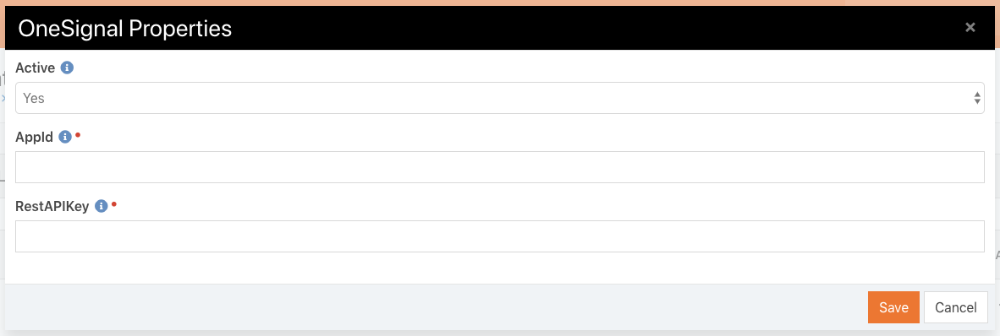
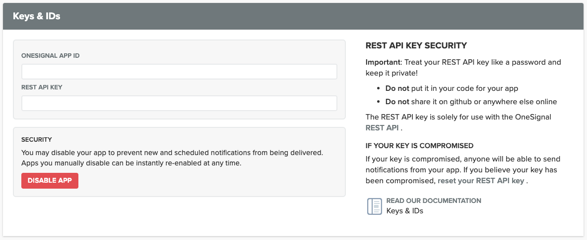
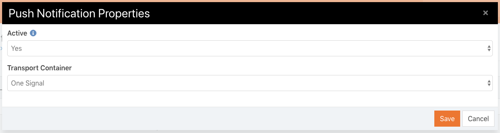

# Apollos OneSignal
A Rock transport for OneSignal. Allows notifications to enabled devices through the OneSignal service. 

## Initial Setup
### If you are on a stable version of Rock (you update Rock from the button in the UI)
* Clone down the `apollos-onesignal` repo [here](https://github.com/ApollosProject/apollos-onesignal).
* Go into the `Versions` folder and copy the `apollosProject.OneSignal.dll` from the correct folder for your version of Rock.
* Paste it in the `Rockweb/Bin` folder of your Rock instance.
* Go into the `bin` folder of the `apollos-onesignal` repo and copy the `Apollos.OneSignal.RestAPIv3.Client.dll` file.
* Paste it in the `Rockweb/Bin` folder of your Rock instance.

### If you update and build your Rock project manually
* Clone down the `apollos-onesignal` repo [here](https://github.com/ApollosProject/apollos-onesignal).
* Put the `apollos-onesignal` folder in the same folder as your `Rock` folder. They should be co-located together.
* In your Rock solution, add the `apollos-onesignal` project. 
* Right-click on your Rock solution and choose `Project Build Order` from the menu.
* Go to the `Dependencies` tab, choose the `apollos-onesignal` project from the dropdown, and click the checkboxes to make `Rock` and `Rock.Common` dependencies. This will ensure that in your build tool that `apollos-onesignal` won't be built until after `Rock` and `Rock.Common`. This is important because `apollos-onesignal` depends on those two projects.
* Now you can run `Clean Solution` and `Rebuild Solution` and everything should just build. Also, when you push changes, your build tool of choice should work as well!

## Rock Setup
* Inside Rock, go to `Admin > Communications > Communication Transports`.
* You should see an option for One Signal. If not, you may need to restart your Rock server. Either way, Rock should detect that the new DLL is there and automatically add the transport to the list on that page. Click on that transport.
* You will need to change the `Active` flag to `Yes` and add the One Signal `App Id` and `REST API Keys`. You can find these on the OneSignal website on the `Settings` page under `Keys & IDs`.

* Go to `Admin > Communications > Communication Mediums`.
* Click on `Push Notifications`
* Make sure the `Active` flag is set to `Yes` and set the `Transport Container` to `One Signal`.

Now you’re all set to send push notifications through Rock!
